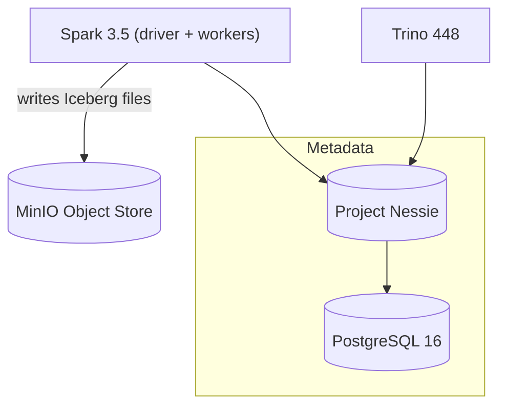
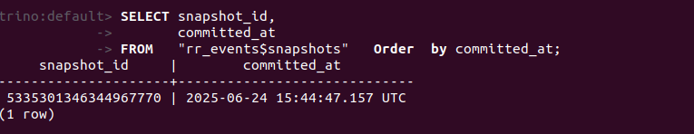
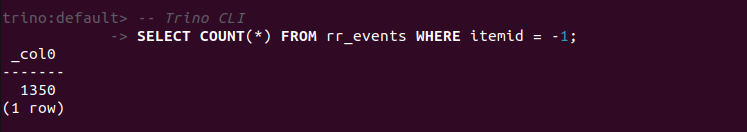
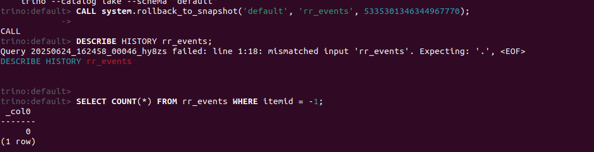

# Cost-Efficient Lakehouse on MinIO + Apache Iceberg

## 1 · Problem  
E-commerce teams quickly outgrow flat S3 / MinIO folders.  
They need **ACID inserts, time-travel rollback, and partition pruning**—without paying enterprise-warehouse pricing.

## 2 · Architecture  

## 3 · Time-travel demo

| Step                          | Screenshot / Command                                                                                                              |
| ----------------------------- | --------------------------------------------------------------------------------------------------------------------------------- |
| **Before update**             |                                                                                             |
| **Update 100 rows**           | `sql UPDATE default.rr_events SET itemid = -1 WHERE event_type = 'view' AND pmod(xxhash64(cast(visitorid AS varchar)), 2000)=0; ` |
| **After update (Δ = 100)**    |                                                                                         |
| **Rollback**                  | `sql CALL system.rollback_to_snapshot('lake."default".rr_events', <old_snapshot_id>); `                                           |
| **Back to zero changed rows** |                                                                                              |

## 4 · Cost / Performance
-- full scan 
EXPLAIN ANALYZE SELECT count(*) FROM rr_events;-- 
physicalInputDataSize = 15.9 GB

-- partition-pruned 
EXPLAIN ANALYZE
SELECT count(*) FROM rr_events
WHERE  event_type = 'transaction'; 
-- physicalInputDataSize = 0.63 GB
| Query                        | Data scanned | % of full |
| ---------------------------- | ------------ | --------- |
| Full table                   | **15.9 GB**  | 100 %     |
| `event_type = 'transaction'` | **0.63 GB**  | **4 %**   |

