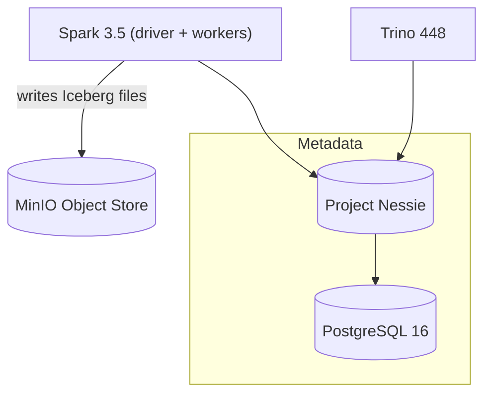

# Cost-Efficient Lakehouse on MinIO + Apache Iceberg

## 1 · Problem
E-commerce teams quickly outgrow flat S3 / MinIO folders.  
They need **ACID inserts, time-travel rollback, and partition pruning**—without paying enterprise-warehouse pricing.

## 2 · Architecture

| Step                                | What you see                                                                                                                    |
| ----------------------------------- | ------------------------------------------------------------------------------------------------------------------------------- |
| **Before update**                   |                                                                                           |
| **Run update**                      | `sql UPDATE default.rr_events SET itemid = -1 WHERE event_type = 'view' AND pmod(xxhash64(cast(visitorid AS string)),2000)=0; ` |
| **After update (100 rows changed)** |                                                                                        |
| **Rollback**                        | `sql CALL system.rollback_to_snapshot('lake."default".rr_events', <old_snapshot_id>); `                                         |
| **Back to zero changed rows**       |                                                                                         |
